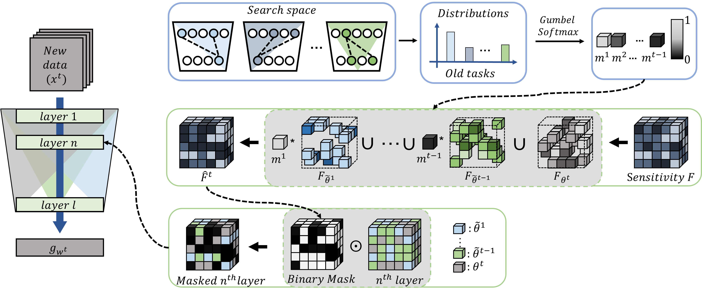

# Helpful or Harmful: Inter-Task Association in Continual Learning

The official code for Helpful or Harmful: Inter-Task Association in Continual Learning 

Author: Hyundong Jin and Eunwoo Kim 

In Proc. of the European Conference on Computer Vision (ECCV), 2022 

<div align="center">


[](https://pytorch.org/)
</div>

Leaderboard of ImageNet with Five Fine grained datasets
> Note that the leaderboard compares methods with network expansion, while $$H^{2}$$ is a method without expanding the network. 

 <div align="center">

[](https://paperswithcode.com/sota/continual-learning-on-imagenet-fine-grained-6?tag_filter=463p=helpful-or-harmful-inter-task-association-in)
[](https://paperswithcode.com/sota/continual-learning-on-cubs-fine-grained-6?metric=Accuracy&tag_filter=463p=helpful-or-harmful-inter-task-association-in)
[](https://paperswithcode.com/sota/continual-learning-on-stanford-cars-fine?tag_filter=463p=helpful-or-harmful-inter-task-association-in)
[](https://paperswithcode.com/sota/continual-learning-on-flowers-fine-grained-6?tag_filter=463p=helpful-or-harmful-inter-task-association-in)
[](https://paperswithcode.com/sota/continual-learning-on-wikiart-fine-grained-6?tag_filter=463p=helpful-or-harmful-inter-task-association-in)
[](https://paperswithcode.com/sota/continual-learning-on-sketch-fine-grained-6?tag_filter=463p=helpful-or-harmful-inter-task-association-in)

[](https://paperswithcode.com/sota/continual-learning-on-split-cifar-10-5-tasks?p=helpful-or-harmful-inter-task-association-in)
[](https://paperswithcode.com/sota/continual-learning-on-split-mnist-5-tasks?p=helpful-or-harmful-inter-task-association-in)




</div>

## Run the code

This repository currently supports the Split CIFAR-10 experiment in the original paper.
  
You can change the hyper-parmeters in the corresponding file (config/CONFIG.py) if needed.
  
```bash
python3 main.py
```

The accuracy of each task is the average of 10 independent runs.

T# represents #-th task. 

<div align="center">

|               |   T1    |   T2    |   T3    |   T4   |   T5   |  Avg acc  |
|:-------------:|:-------:|:-------:|:-------:|:------:|:------:|:---------:|
| H2            |  98.82  |  94.13  |  96.36  | 98.90  |  98.27 |   97.30   | 

</div>

## Requirements 
  
Please, find a list with required packages and versions in requirements.txt

## Code list 

```bash
config
  ㄴ CONFIG.py
data_loader
  ㄴ split_cifar10_data.py
model
  ㄴ resnet18.py
src 
  ㄴ main.py
  ㄴ manager.py
  ㄴ pruner.py
```
